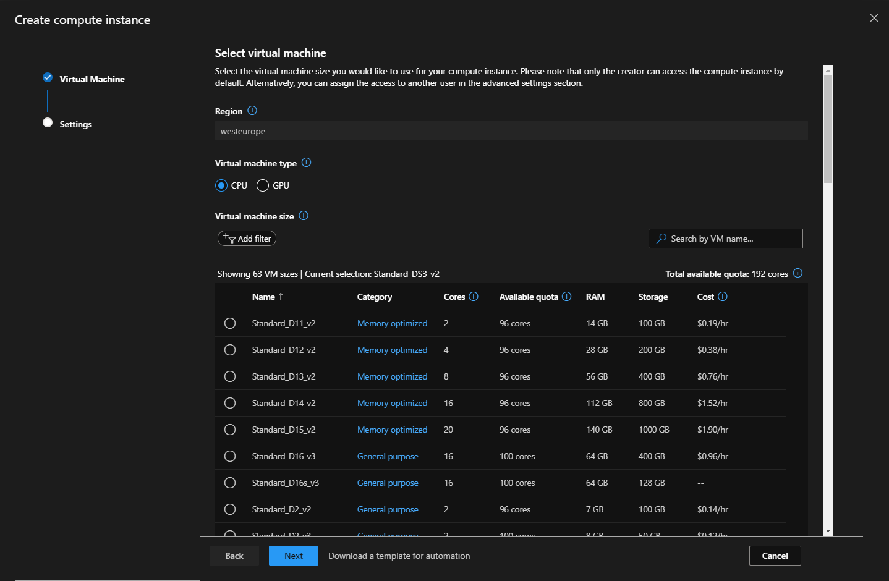
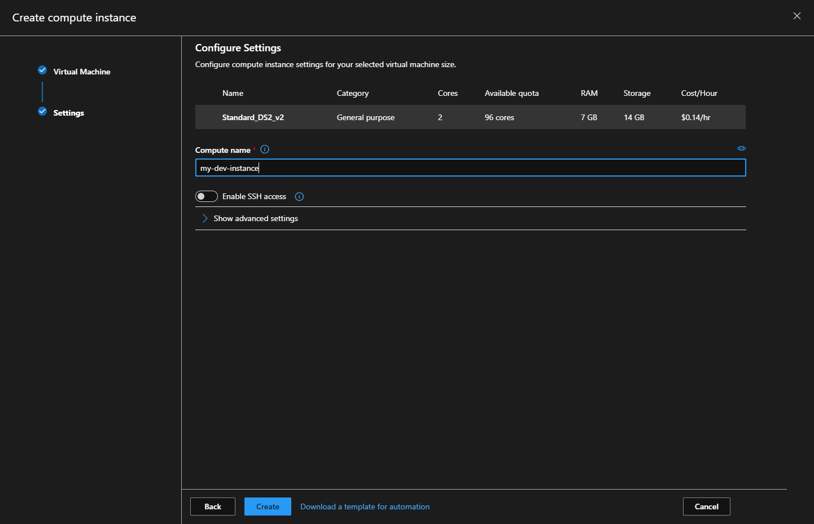
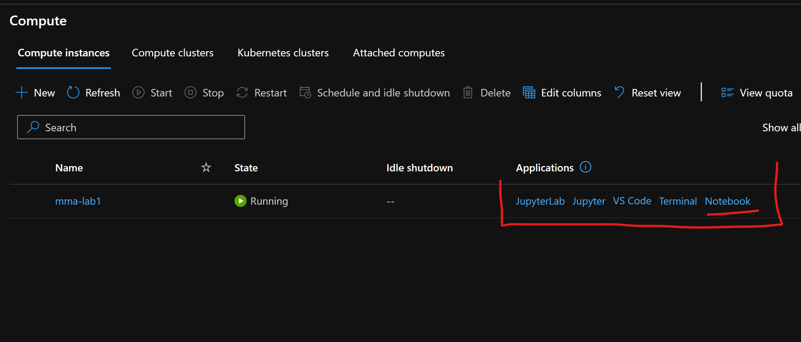
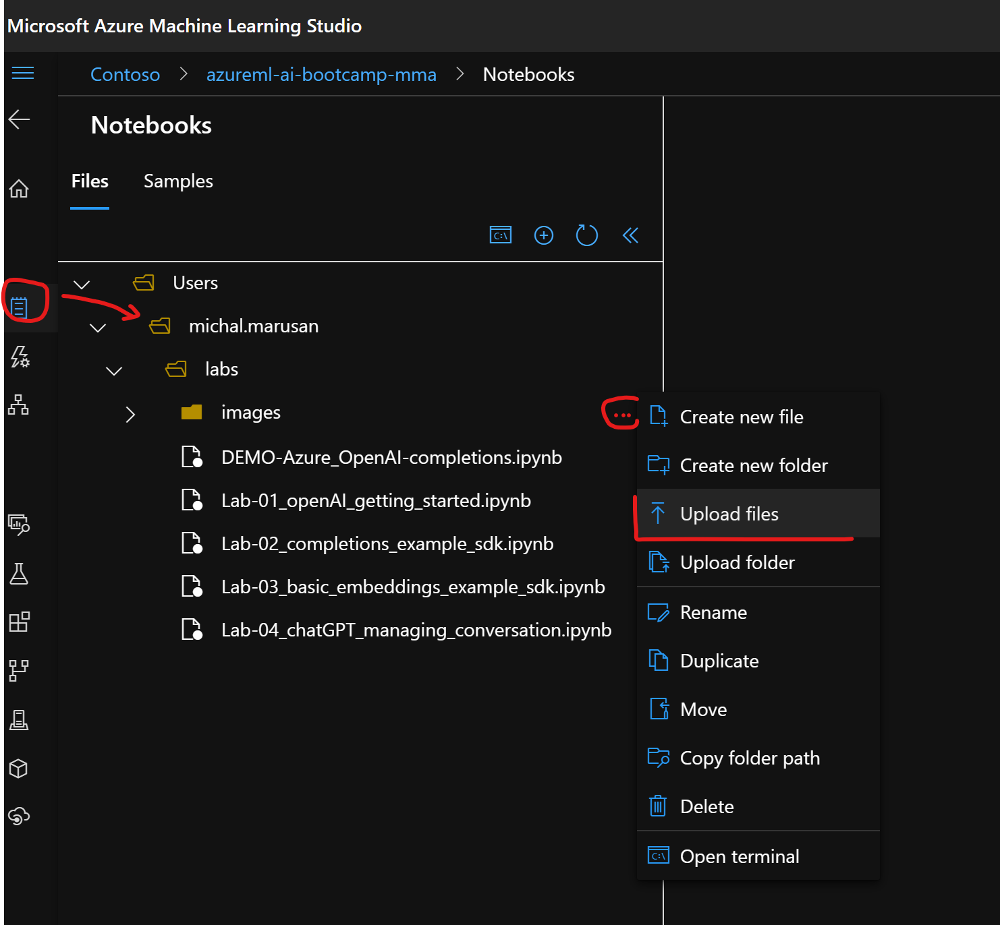

## Create a workspace

A workspace is a foundational resource in the cloud that you use to experiment, train, and deploy machine learning models. It ties your Azure subscription and resource group to an easily consumed object in the SDK. If you already have an Azure Machine Learning service workspace, skip to the [next section](#azure). Otherwise, create one now.

1. Sign in to [Azure portal](https://portal.azure.com/) by using the credentials for your Azure subscription.

1. In the upper-left corner of Azure portal, select **+ Create a resource**.

    

1. Use the search bar to find **Machine Learning**.

1. Select **Machine Learning**.

1. In the **Machine Learning** pane, select **Create** to begin.

1. Provide the following information to configure your new workspace:

   Field|Description 
   ---|---
   Workspace name |Enter a unique name that identifies your workspace. In this example, we use **docs-ws**. Names must be unique across the resource group. Use a name that's easy to recall and to differentiate from workspaces created by others.  
   Subscription |Select the Azure subscription that you want to use.
   Resource group | Use an existing resource group in your subscription or enter a name to create a new resource group. A resource group holds related resources for an Azure solution. In this example, we use **docs-aml**. 
   Location | Select the location closest to your users and the data resources to create your workspace.
   Workspace edition | Select **Basic** as the workspace type for this tutorial. The workspace type (Basic & Enterprise) determines the features to which you’ll have access and pricing. Everything in this tutorial can be performed with either a Basic or Enterprise workspace.

1. After you are finished configuring the workspace, select **Review + Create**. 

   > [!Warning] 
   > It can take several minutes to create your workspace in the cloud.

   When the process is finished, a deployment success message appears. 
 
 1. To view the new workspace, select **Go to resource**.

## Create your ML workstation -  Compute Instance

Go to [AML Studio](https://ml.azure.com) and **sign in** and locate your newly created workspace

In your workspace in Azure Machine Learning studio, create a new compute instance from either the **Compute** section or in the **Notebooks** section when you are ready to run one of your notebooks.

Hit next.

|Field  |Description  |
|---------|---------|
|Compute name     |  <li>Name is required and must be between 3 to 24 characters long.</li><li>Valid characters are upper and lower case letters, digits, and the  **-** character.</li><li>Name must start with a letter</li><li>Name needs to be unique across all existing computes within an Azure region. You will see an alert if the name you choose is not unique</li><li>If **-**  character is used, then it needs to be followed by at least one letter later in the name</li>     |
|Virtual machine type |  Choose CPU or GPU. This type cannot be changed after creation     |
|Virtual machine size     |  Supported virtual machine sizes might be restricted in your region. Check the [availability list](https://azure.microsoft.com/global-infrastructure/services/?products=virtual-machines)     |
|Enable/disable SSH access     |   SSH access is disabled by default.  SSH access cannot be. changed after creation. Make sure to enable access if you plan to debug interactively with [VS Code Remote](how-to-set-up-vs-code-remote.md)   |
|Advanced settings     |  Optional. Configure a virtual network. Specify the **Resource group**, **Virtual network**, and **Subnet** to create the compute instance inside an Azure Virtual Network (vnet). For more information, see these [network requirements](how-to-enable-virtual-network.md#compute-instance) for vnet .        |

You can also create an instance
* Directly from the [integrated notebooks experience](tutorial-1st-experiment-sdk-setup.md#azure)
* In Azure portal
* From Azure Resource Manager template
* With [Azure Machine Learning SDK](https://github.com/Azure/MachineLearningNotebooks/blob/master/how-to-use-azureml/training/train-on-computeinstance/train-on-computeinstance.ipynb)
* From the [CLI extension for Azure Machine Learning](reference-azure-machine-learning-cli.md#computeinstance)

The dedicated cores per region per VM family quota and total regional quota, which applies to compute instance creation. is unified and shared with Azure Machine Learning training compute cluster quota. Stopping the compute instance does not release quota to ensure you will be able to restart the compute instance.

### Launch your IDE web interface

After you created Compute Instance simply access the Jupyter from Compute page of your AML Studio.

### Upload the lab notebooks
Select `Notebooks` from the left-hand vertical menu in Azure Machine Learning studio. Under files, select your name (email / login) or create folder and upload notebook files from the repo (folder `labs`):

